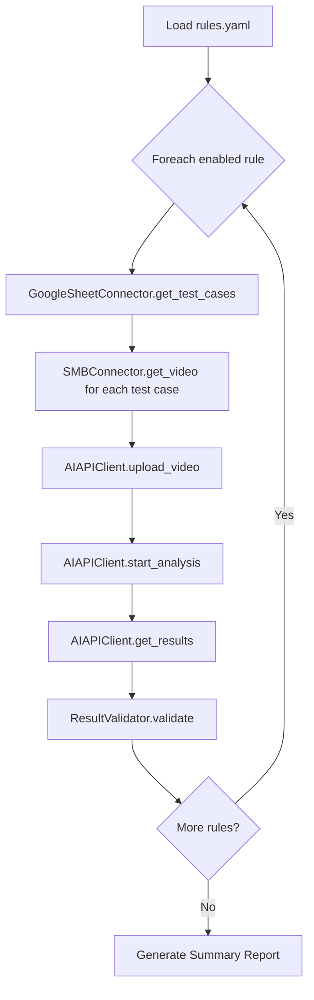

# Sơ đồ Cấu Trúc Project AI Testing

## 📁 Cấu Trúc Thư Mục

```
ai_model_testing/
│
├── config/
│   ├── settings.py              # Tất cả config (API, credentials, rules list)
│   └── rules.yaml               # Danh sách rules cần test
│
├── src/
│   ├── __init__.py
│   │
│   ├── connectors.py            # GoogleSheetConnector, SMBConnector, AIAPIClient
│   ├── models.py                # Rule, TestCase, Video, BoundingBox, Result
│   ├── processor.py             # TestProcessor - xử lý toàn bộ workflow
│   └── validator.py             # ResultValidator - so sánh kết quả
│
├── tests/
│   ├── conftest.py              # Pytest fixtures
│   ├── test_rules.py            # Test từng rule và multi-rules
│   └── test_e2e.py              # Test end-to-end
│
├── data/
│   ├── videos/                  # Video test
│   └── results/                 # Kết quả output
│
├── logs/
│
├── docs/
│   ├── README.md                # Setup + usage + troubleshooting
│   └── RULES.md                 # Mô tả các rules
│
├── requirements.txt
├── pytest.ini
├── .env.example
└── run_tests.py                 # Script chạy test
```

---

## 📋 Config Files

### `config/rules.yaml`

```yaml
rules:
  - id: PHONE_01
    name: "Sử dụng điện thoại"
    sheet: "Phone Usage"
    enabled: true
  
  - id: LANE_01
    name: "Đi sai làn"
    sheet: "Wrong Lane"
    enabled: true
  
  - id: SPEED_01
    name: "Quá tốc độ"
    sheet: "Speeding"
    enabled: false
```

### `config/settings.py`

```python
# API Configuration
AI_API_BASE_URL = "https://api.example.com"
AI_API_KEY = os.getenv("AI_API_KEY")

# Google Sheets
GOOGLE_SHEET_ID = os.getenv("GOOGLE_SHEET_ID")
GOOGLE_CREDENTIALS_PATH = "credentials.json"

# SMB Storage
SMB_HOST = os.getenv("SMB_HOST")
SMB_USERNAME = os.getenv("SMB_USERNAME")
SMB_PASSWORD = os.getenv("SMB_PASSWORD")
SMB_VIDEO_DIR = "/videos/test"
```

---

## 🔧 Source Files

### `src/connectors.py`

**GoogleSheetConnector**
- `connect()` - Kết nối Google Sheets
- `get_test_cases(sheet_name)` → `List[TestCase]` - Lấy test cases từ sheet
- `update_result(sheet_name, row, result)` - Cập nhật kết quả vào sheet

**SMBConnector**
- `connect(host, username, password)` - Kết nối SMB
- `get_video(video_name)` → `bytes` - Lấy video từ SMB storage

**AIAPIClient**
- `upload_video(data)` → `video_id` - Upload video lên AI API
- `start_analysis(video_ids, config)` → `job_id` - Bắt đầu phân tích
- `get_results(job_id)` → `dict` - Lấy kết quả phân tích

---

### `src/models.py`

**Rule**
```python
- id: str
- name: str
- sheet_name: str
- enabled: bool
```

**TestCase**
```python
- video_name: str
- rule: Rule
- expected_violation: bool
- expected_bounding_boxes: List[BoundingBox]
```

**Video**
```python
- name: str
- path: str
- data: bytes
```

**Result**
```python
- actual_violation: bool
- actual_bounding_boxes: List[BoundingBox]
- confidence: float
- metrics: dict
```

---

### `src/processor.py`

**TestProcessor**
- `run_rule(rule)` → `RuleReport` - Chạy test cho 1 rule
- `run_all_rules()` → `SummaryReport` - Chạy test tất cả rules
- `_workflow()` - Pipeline: load_data → upload → analyze → validate

**Private Methods:**
- `_load_test_data(rule)` - Load data từ Google Sheet
- `_download_videos(test_cases)` - Download videos từ SMB
- `_upload_videos(videos)` - Upload lên AI API
- `_analyze_videos(video_ids, rule)` - Analyze với config của rule
- `_validate_results(expected, actual)` - Validate kết quả

---

### `src/validator.py`

**ResultValidator**
- `validate(expected, actual)` → `(bool, dict)` - So sánh expected vs actual
- `calculate_iou(box1, box2)` → `float` - Tính IoU của bounding boxes
- `calculate_metrics(all_results)` → `dict` - Tính precision, recall, F1

**Metrics:**
- Precision
- Recall
- F1 Score
- IoU (Intersection over Union)
- True Positives / False Positives / False Negatives

---

## 🔄 Workflow



### Chi tiết từng bước:

1. **Load Rules** - Đọc `rules.yaml`, lọc rules có `enabled=true`

2. **Load Test Data** - Với mỗi rule:
   - Lấy test cases từ Google Sheet tương ứng
   - Parse expected results và bounding boxes

3. **Download Videos** - Download videos từ SMB storage theo tên

4. **Upload to AI** - Upload videos lên hệ thống AI qua API

5. **Configure & Analyze** - Config rule và bắt đầu analyze

6. **Get Results** - Poll API để lấy kết quả (violation + bounding boxes)

7. **Validate** - So sánh actual vs expected:
   - Violation đúng/sai
   - IoU của bounding boxes
   - Calculate metrics

8. **Report** - Generate báo cáo chi tiết cho từng rule và tổng hợp

---

## 🧪 Testing Structure

### `tests/conftest.py`

**Fixtures:**
```python
@pytest.fixture
def mock_google_sheet():
    # Mock GoogleSheetConnector
    
@pytest.fixture
def mock_smb():
    # Mock SMBConnector
    
@pytest.fixture
def mock_ai_api():
    # Mock AIAPIClient
    
@pytest.fixture
def sample_rules():
    # Return danh sách rules mẫu
    
@pytest.fixture
def sample_test_cases():
    # Return test cases mẫu
```

---

### `tests/test_rules.py`

**Test Cases:**
- `test_phone_usage_rule()` - Test rule sử dụng điện thoại
- `test_wrong_lane_rule()` - Test rule đi sai làn
- `test_all_rules_sequential()` - Test tất cả rules tuần tự
- `test_all_rules_parallel()` - Test tất cả rules song song
- `test_rule_with_violations()` - Test với vi phạm
- `test_rule_without_violations()` - Test không vi phạm
- `test_partial_matches()` - Test khi bounding box match một phần

---

### `tests/test_e2e.py`

**End-to-End Tests:**
- `test_full_pipeline()` - Test toàn bộ pipeline từ đầu đến cuối
- `test_error_handling()` - Test xử lý lỗi
- `test_retry_mechanism()` - Test retry khi fail
- `test_report_generation()` - Test tạo báo cáo

---

## 📊 Google Sheet Structure

### Sheet: "Phone Usage"

| Video Name | Expected Violation | Expected Bounding Boxes (JSON) | Frame Numbers | Notes | Test Result | Test Date |
|------------|-------------------|-------------------------------|---------------|-------|-------------|-----------|
| video_001.mp4 | Yes | `[{"x":100,"y":200,"w":50,"h":50,"frame":15}]` | 15,30,45 | Clear phone usage | - | - |
| video_002.mp4 | No | `[]` | - | No violation | - | - |

### Sheet: "Wrong Lane"

| Video Name | Expected Violation | Lane Coordinates (JSON) | Vehicle Coordinates (JSON) | Test Result | Test Date |
|------------|-------------------|------------------------|---------------------------|-------------|-----------|
| video_003.mp4 | Yes | `[{"x1":0,"y1":0,"x2":100,"y2":500}]` | `[{"x":150,"y":250,"w":80,"h":120}]` | - | - |

---

## 🚀 Usage

### Chạy tất cả tests

```bash
python run_tests.py
```

### Chạy test cho 1 rule cụ thể

```bash
python run_tests.py --rule PHONE_01
```

### Chạy với pytest

```bash
# Tất cả tests
pytest tests/ -v

# Test một file
pytest tests/test_rules.py -v

# Test một function cụ thể
pytest tests/test_rules.py::test_phone_usage_rule -v

# Chạy song song
pytest tests/ -n auto
```

### Generate report

```bash
pytest tests/ --html=report.html --self-contained-html
```

---

## 📦 Dependencies

### `requirements.txt`

```txt
# Google Sheets
google-auth==2.23.0
google-auth-oauthlib==1.1.0
google-api-python-client==2.100.0

# SMB
pysmb==1.2.9.1

# HTTP Client
requests==2.31.0

# Testing
pytest==7.4.3
pytest-html==4.1.1
pytest-xdist==3.5.0

# Data Processing
pyyaml==6.0.1
pandas==2.1.3

# Utilities
python-dotenv==1.0.0
```

---

## 🔐 Environment Variables

### `.env.example`

```bash
# AI API
AI_API_KEY=your_api_key_here
AI_API_BASE_URL=https://api.example.com

# Google Sheets
GOOGLE_SHEET_ID=your_sheet_id_here

# SMB Storage
SMB_HOST=192.168.1.100
SMB_USERNAME=your_username
SMB_PASSWORD=your_password
SMB_SHARE_NAME=videos
SMB_VIDEO_DIR=/test_videos

# Test Config
PARALLEL_EXECUTION=true
MAX_WORKERS=3
```

---

## 📈 Report Structure

### RuleReport (cho mỗi rule)

```python
{
    "rule_id": "PHONE_01",
    "rule_name": "Sử dụng điện thoại",
    "total_cases": 50,
    "passed": 45,
    "failed": 5,
    "metrics": {
        "precision": 0.92,
        "recall": 0.89,
        "f1_score": 0.90,
        "avg_iou": 0.75
    },
    "failed_cases": [...]
}
```

### SummaryReport (tổng hợp)

```python
{
    "total_rules": 3,
    "total_cases": 150,
    "total_passed": 135,
    "total_failed": 15,
    "overall_accuracy": 0.90,
    "rule_reports": [...]
}
```